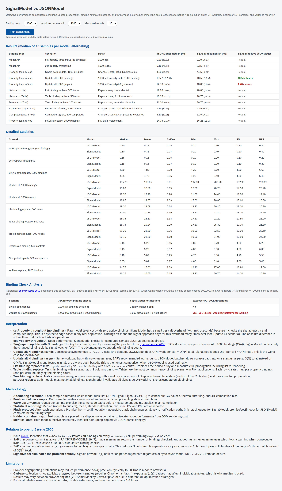

<h1 align="center">ui5-lib-signal-model</h1>

<p align="center">A reactive, signal-based UI5 model that is a drop-in replacement for JSONModel. Uses the <a href="https://github.com/tc39/proposal-signals">TC39 Signals proposal</a> polyfill internally, replacing poll-based <code>checkUpdate()</code> with push-based, path-specific signal notifications.</p>

> [!CAUTION]
> This is an **experimental proof of concept** exploring reactive primitives in the UI5 ecosystem. It was developed with full AI assistance using speech-to-text during post-surgery recovery. Treat it as a technical exploration and learning exercise, not a production-ready library.

## Installation

```bash
npm install ui5-lib-signal-model
```

Add to your `ui5.yaml` dependencies and `manifest.json`:

```json
"sap.ui5": {
  "dependencies": {
    "libs": {
      "ui5.model.signal": {}
    }
  }
}
```

## Usage

```typescript
import SignalModel from "ui5/model/signal/SignalModel";

// Drop-in replacement for JSONModel
const model = new SignalModel({
  customer: { name: "Alice", age: 28 },
  orders: [],
});

// Works with standard XML view bindings
// {/customer/name}, {/orders}, etc.
```

### Typed Model

```typescript
interface AppData {
  customer: { name: string; age: number };
  orders: Array<{ id: number; total: number }>;
}

const model = new SignalModel<AppData>({
  customer: { name: "Alice", age: 28 },
  orders: [],
});

model.getProperty("/customer/name"); // string (typed)
model.setProperty("/customer/age", 31); // type-checked
model.setProperty("/customer/age", "x"); // compile error
```

Path types follow the same conventions as UI5's typed model patterns from `@openui5/types`.

### Declarative Binding

SignalModel works with standard UI5 declarative bindings in XML views, one-way and two-way:

```xml
<!-- Property binding -->
<Input value="{/customer/name}" />
<Text text="{/customer/name}" />

<!-- List binding -->
<List items="{/orders}">
  <StandardListItem title="{id}" description="{total}" />
</List>

<!-- Tree binding -->
<Tree items="{path: '/org', parameters: {arrayNames: ['children']}}">
  <StandardTreeItem title="{name}" />
</Tree>

<!-- Named model -->
<Text text="{signals>/customer/name}" />

<!-- Expression binding -->
<Text text="{= ${/customer/name} + ' (' + ${/customer/age} + ')'}" />
```

### Computed Signals

Derived values that update automatically when dependencies change:

```typescript
model.createComputed("/fullName", ["/firstName", "/lastName"], (first, last) => `${first} ${last}`);

// Bind to it like any other path
// <Text text="{/fullName}" />
```

### Merge Writes

Surgical updates that only notify changed paths:

```typescript
// Only /customer/age fires, /customer/name stays untouched
model.mergeProperty("/customer", { age: 30 });
```

## Feature Comparison: SignalModel vs JSONModel

| Feature                        | JSONModel                                                         | SignalModel                                                            |
| ------------------------------ | ----------------------------------------------------------------- | ---------------------------------------------------------------------- |
| **Update mechanism**           | Poll-based: `checkUpdate()` iterates all bindings on every change | Push-based: only bindings to changed paths are notified via signals    |
| **Notification granularity**   | O(n) on total bindings per `setProperty` call                     | O(k) where k = bindings to changed path + parent paths                 |
| **Change detection**           | `deepEqual` comparison on every binding                           | Signal-based: no comparison for primitives, object-aware for mutations |
| **Property binding**           | `{/path}` in XML views                                            | Identical                                                              |
| **List binding**               | Filter + Sort via FilterProcessor/SorterProcessor                 | Same (reuses ClientListBinding internals)                              |
| **Tree binding**               | JSONTreeBinding with arrayNames                                   | SignalTreeBinding with same arrayNames support                         |
| **Expression binding**         | Supported                                                         | Supported (benefits from push-based dependency notification)           |
| **Two-way binding**            | Supported                                                         | Supported (identical behavior)                                         |
| **Declarative XML binding**    | Supported                                                         | Supported (full lifecycle: one-way, two-way, list, tree)               |
| **Named models**               | `{modelName>/path}`                                               | Identical                                                              |
| **Binding modes**              | OneWay, TwoWay, OneTime                                           | Same (inherits from ClientModel)                                       |
| **Nested bindings**            | Relative paths with context                                       | Same (relative and absolute)                                           |
| **setProperty / getProperty**  | Standard API                                                      | Same signatures, typed overloads with generics                         |
| **setData (replace)**          | Replaces data, notifies all bindings                              | Replaces data, fires all signals                                       |
| **setData (merge)**            | Merges data, notifies all bindings                                | Merges data, fires only changed signals                                |
| **mergeProperty**              | Not available                                                     | Surgical merge at any path, fires only changed signals                 |
| **Computed/derived values**    | Not available (use formatters)                                    | `createComputed("/path", deps, fn)` for model-layer derived state      |
| **Programmatic signal access** | Not available                                                     | `getSignal("/path")` returns underlying Signal.State                   |
| **Strict mode**                | Not available                                                     | `{ strict: true }` throws on nonexistent paths                         |
| **TypeScript generics**        | Via TypedJSONModel wrapper                                        | Built-in: `new SignalModel<T>(data)` with path autocompletion          |
| **TC39 Signals alignment**     | N/A                                                               | Uses signal-polyfill; swap for native Signal when spec ships           |

## API

### Constructor

```typescript
new SignalModel<T>(data?: T, options?: { strict?: boolean })
```

### JSONModel-Compatible Methods

```typescript
model.setProperty("/path", value);
model.getProperty("/path");
model.setData(data); // replace
model.setData(partial, true); // merge
model.getData();
model.bindProperty("/path");
model.bindList("/path");
model.bindTree("/path", context, filters, { arrayNames: ["children"] }, sorters);
```

### Extended Methods

```typescript
// Merge writes (only fire changed paths)
model.mergeProperty("/customer", { age: 30 });

// Computed signals
model.createComputed("/fullName", ["/firstName", "/lastName"], (first, last) => `${first} ${last}`);
model.removeComputed("/fullName");

// Direct signal access (read-only recommended)
const signal = model.getSignal("/path");
signal.get(); // read current value
```

### Binding Classes

| Class                   | Extends                 | Purpose                                              |
| ----------------------- | ----------------------- | ---------------------------------------------------- |
| `SignalPropertyBinding` | `ClientPropertyBinding` | Single-value bindings with Watcher push              |
| `SignalListBinding`     | `ClientListBinding`     | List bindings with filter/sort, Watcher push         |
| `SignalTreeBinding`     | `ClientTreeBinding`     | Tree bindings with hierarchy traversal, Watcher push |

## Architecture

```
XML View bindings: {/customer/name}, {/orders}, {path: '/tree', ...}
        |
        | bindProperty / bindList / bindTree
        v
SignalPropertyBinding / SignalListBinding / SignalTreeBinding
  - Each subscribes to its path's signal via Signal.subtle.Watcher
  - Push-based: queueMicrotask batching, no polling
        |
        | reads / subscribes
        v
Signal Registry (Map<string, Signal.State | Signal.Computed>)
  - Signals created lazily on first bind
  - Custom equality: primitives use Object.is, objects always notify
        |
        | setProperty / setData / mergeProperty
        v
SignalModel (extends ClientModel)
  - this.oData = raw JS object (source of truth)
  - setProperty -> update oData + set signal + invalidate parents
  - setData replace -> update oData + invalidate all signals
  - setData merge -> update oData + invalidate only merge payload paths
  - mergeProperty -> deep merge + recursive change detection
```

## Testing

QUnit test modules covering unit, integration, and declarative binding. Automated via WDIO + headless Chrome:

```bash
npm run test:qunit
```

## Performance Benchmark

A self-contained benchmark page compares SignalModel vs JSONModel across 10 scenarios covering all binding types: property bindings (`sap.m.Text`), list bindings (`sap.m.List`, `sap.m.Table`), tree bindings (`sap.m.Tree`), expression bindings, and computed signals.

```bash
npm run start:bench  # opens benchmark page
```

The benchmark uses alternating A-B execution order, JIT warmup, Bessel-corrected sample statistics, and a three-stage async flush protocol. It directly measures the `checkUpdate` bottleneck documented in [openui5 issue 2600](https://github.com/UI5/openui5/issues/2600).



The key result: with default synchronous `setProperty`, **"Update all N bindings"** shows ~10x improvement at 1000 bindings (202ms vs 19ms). The benchmark also tests JSONModel's `bAsyncUpdate=true` workaround for an honest comparison. For list/table/tree replace operations, both models perform equivalently because DOM rendering cost dominates.

See [packages/lib/test/benchmark/README.md](packages/lib/test/benchmark/README.md) for the full analysis, including honest observations about where SignalModel does and does not improve over JSONModel.

## Demo Application

7 interactive showcase pages:

- **Properties** - two-way form binding with live display
- **List** - table with filter, sort, add item
- **Tree** - org chart hierarchy with add employee
- **Computed** - derived fullName and birthYear
- **Programmatic** - getSignal() direct access
- **Strict** - error display for invalid paths
- **Comparison** - side-by-side SignalModel vs JSONModel

```bash
npm run start  # opens demo app
```

## Development

```bash
npm install
npm run start       # demo app
npm run start:lib   # library dev server
npm run test:qunit  # QUnit tests via WDIO
npm run check       # lint + typecheck
npm run build       # production build
```

## License

MIT
