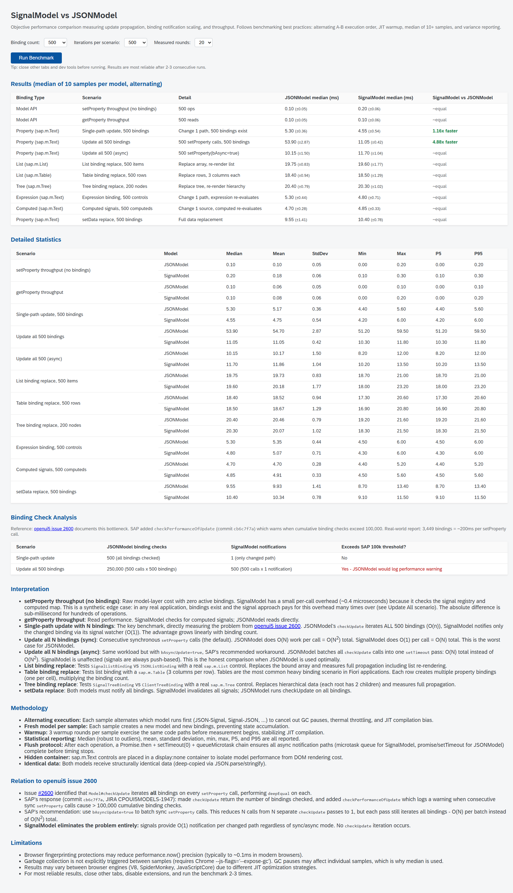

# SignalModel vs JSONModel - Performance Benchmark

Self-contained benchmark comparing SignalModel and JSONModel across all binding types.

## Quick Start

```bash
npm run start:bench
```

This starts the library dev server and opens the benchmark page in your browser.

## What It Tests

The benchmark covers 10 scenarios across all binding types and model operations:

| #   | Binding Type              | Scenario                             | What It Measures                                      |
| --- | ------------------------- | ------------------------------------ | ----------------------------------------------------- |
| 1   | Model API                 | setProperty throughput (no bindings) | Raw per-call overhead of model layer                  |
| 2   | Model API                 | getProperty throughput               | Read performance                                      |
| 3   | Property (`sap.m.Text`)   | Single-path update, N bindings       | O(1) vs O(N) notification - the key benchmark         |
| 4   | Property (`sap.m.Text`)   | Update all N bindings                | O(N) vs O(N^2) cumulative cost                        |
| 5   | List (`sap.m.List`)       | List binding replace                 | Array replacement with `StandardListItem` template    |
| 6   | List (`sap.m.Table`)      | Table binding replace                | Row replacement with 3 `ColumnListItem` cells         |
| 7   | Tree (`sap.m.Tree`)       | Tree binding replace                 | Hierarchical data replacement with `StandardTreeItem` |
| 8   | Expression (`sap.m.Text`) | Expression binding                   | Composite `{= ${/path1} + ${/path2}}` re-evaluation   |
| 9   | Computed (`sap.m.Text`)   | Computed signals                     | `createComputed` dependency chain propagation         |
| 10  | Property (`sap.m.Text`)   | setData replace                      | Full data replacement propagation                     |

## How It Works

### Bootstrap

The page loads UI5 via the standard bootstrap script served by `ui5 serve`. The `ui5-tooling-transpile-middleware` transpiles TypeScript on-the-fly and `ui5-tooling-modules-middleware` resolves npm dependencies (`signal-polyfill`) into UI5-compatible modules.

### Module Loading

When "Run Benchmark" is clicked, `sap.ui.require` loads:

- `sap/ui/model/json/JSONModel` (from the OpenUI5 framework)
- `ui5/model/signal/SignalModel` (from our library, transpiled from TypeScript)
- Control classes: `sap/m/Text`, `sap/m/List`, `sap/m/Table`, `sap/m/Tree`, and their list items

### Execution

Each scenario:

1. Creates a fresh model with deep-copied data (`JSON.parse(JSON.stringify(...))`)
2. Creates real UI5 controls with declarative bindings, placed in a hidden `display:none` container
3. Runs 3 warmup rounds to stabilize JIT compilation
4. Takes 1 timed measurement including full async propagation
5. Destroys all controls and the model

The `runAlternating` function interleaves JSON and Signal runs (JSON-Signal, Signal-JSON, JSON-Signal...) across all samples to cancel out GC pauses, thermal throttling, and JIT compilation bias.

### Flush Protocol

After each timed operation, a three-stage async drain ensures all notifications complete:

1. `Promise.resolve().then(...)` - drains microtask queue (SignalModel's `queueMicrotask` callbacks)
2. `setTimeout(resolve, 0)` - yields to macrotask queue (JSONModel's async `checkUpdate`)
3. `queueMicrotask(resolve)` - final microtask drain for any cascaded notifications

### Statistics

Uses Bessel-corrected (sample) variance. Reports: median, mean, standard deviation, min, max, P5, P95. Median is the primary metric as it is robust to GC-caused outliers.

## Results (500 bindings, 500 iterations, 10 rounds)

**500 bindings:**



**1000 bindings:**


**2000 bindings:**


### "Update all" scaling across binding counts (the key scenario)

| Bindings | JSON sync | Signal sync | Signal advantage | JSON async | Signal async |
| -------- | --------- | ----------- | ---------------- | ---------- | ------------ |
| 500      | 53.90ms   | 11.05ms     | **4.9x faster**  | 10.15ms    | 11.70ms      |
| 1000     | 198.05ms  | 18.70ms     | **10.6x faster** | 12.25ms    | 19.40ms      |
| 2000     | 893.25ms  | 56.00ms     | **16.0x faster** | 29.25ms    | 54.85ms      |

### Full results at 1000 bindings (20 rounds)

| Binding Type            | Scenario                          | JSONModel | SignalModel | Comparison        |
| ----------------------- | --------------------------------- | --------- | ----------- | ----------------- |
| Model API               | setProperty (no bindings)         | 0.20ms    | 0.20ms      | ~equal            |
| Model API               | getProperty                       | 0.10ms    | 0.20ms      | ~equal            |
| Property (sap.m.Text)   | Single-path update, 1000 bindings | 5.20ms    | 4.90ms      | ~equal            |
| Property (sap.m.Text)   | Update all 1000 (sync)            | 198.05ms  | 18.70ms     | **10.59x faster** |
| Property (sap.m.Text)   | Update all 1000 (async)           | 12.25ms   | 19.40ms     | **1.58x slower**  |
| List (sap.m.List)       | List binding replace, 500 items   | 19.05ms   | 19.65ms     | ~equal            |
| List (sap.m.Table)      | Table binding replace, 500 rows   | 19.15ms   | 18.70ms     | ~equal            |
| Tree (sap.m.Tree)       | Tree binding replace, 200 nodes   | 21.25ms   | 20.80ms     | ~equal            |
| Expression (sap.m.Text) | Expression binding, 500 controls  | 5.00ms    | 5.00ms      | ~equal            |
| Computed (sap.m.Text)   | Computed signals, 500 computeds   | 5.10ms    | 5.00ms      | ~equal            |
| Property (sap.m.Text)   | setData replace                   | 15.05ms   | 15.65ms     | ~equal            |

### Honest Observations

**Where SignalModel is faster:**

The "Update all N bindings (sync)" scenario shows the largest difference: at 1000 bindings, JSONModel takes ~200ms while SignalModel takes ~19ms (~10x faster). This is because JSONModel's default synchronous `setProperty` calls `checkUpdate` after every single call, iterating all bindings each time (O(N^2) total).

**The `bAsyncUpdate` caveat:**

JSONModel's `setProperty` accepts a `bAsyncUpdate` parameter. When `true`, it batches all `checkUpdate` calls into a single `setTimeout` pass, collapsing O(N^2) to O(N). The benchmark includes this scenario ("Update all N async") for an honest comparison.

With `bAsyncUpdate=true`, **JSONModel is actually faster than SignalModel** for bulk batch updates. At 1000 bindings: JSONModel-async takes ~12ms while SignalModel takes ~19ms. Both execute ONE batched pass, but the per-binding work differs:

| Step                         | JSONModel async                 | SignalModel                                                              |
| ---------------------------- | ------------------------------- | ------------------------------------------------------------------------ |
| During N `setProperty` calls | Sets data, schedules 1 timer    | Sets data, fires N watcher callbacks, each does `Map.set()`              |
| Batched flush                | 1 loop: `deepEqual` per binding | 1 loop: `signal.get()` + `watcher.watch()` + `checkUpdate()` per binding |

The overhead comes from the TC39 `Signal.subtle.Watcher` API contract: after a signal notifies its watcher, the watcher must be explicitly re-armed by calling `signal.get()` (to acknowledge the change) then `watcher.watch()` (to re-register). This is inherent to the polyfill's design and cannot be optimized away without changes to the signal-polyfill itself. JSONModel's `deepEqual` comparison is a single function call per binding with no re-registration overhead.

**Where both models are equivalent:**

For list, table, and tree binding scenarios where the entire aggregation is replaced, both models perform equivalently. The DOM rendering cost (destroying and recreating list items, table rows, tree nodes) dominates the model notification cost by an order of magnitude. The model layer is not the bottleneck in these scenarios.

Expression binding, computed signals, getProperty, setProperty (no bindings), and setData replace are all equivalent between the two models.

**What SignalModel still offers over JSONModel with `bAsyncUpdate`:**

1. **Correct by default.** Developers do not need to remember to pass `bAsyncUpdate=true`. SAP added a runtime performance warning (`checkPerformanceOfUpdate`) specifically because developers keep using the synchronous default. SignalModel is always O(1) per notification regardless of how `setProperty` is called.

2. **Per-path notification.** Even with `bAsyncUpdate=true`, JSONModel's single `checkUpdate` pass still iterates ALL bindings and runs `deepEqual` on each. With 3,000+ bindings (the scale reported in [openui5 issue 2600](https://github.com/UI5/openui5/issues/2600)), this single pass alone takes ~200ms. SignalModel notifies only the bindings on changed paths.

3. **Computed signals.** Model-layer derived values (`createComputed`) that update reactively. JSONModel has no equivalent (formatters are view-layer and do not participate in the model's dependency graph).

4. **TC39 Signals alignment.** When the [TC39 Signals proposal](https://github.com/tc39/proposal-signals) ships natively in browsers, `signal-polyfill` can be swapped for the native implementation with zero API changes.

## Background

- [openui5 issue 2600](https://github.com/UI5/openui5/issues/2600) - documents the `checkUpdate` O(N) bottleneck
- [openui5 issue 4351](https://github.com/UI5/openui5/issues/4351) - related DOM accumulation problem in large apps
- SAP commit `cb6c7f7a` - added `checkPerformanceOfUpdate` warning at 100,000 cumulative binding checks
