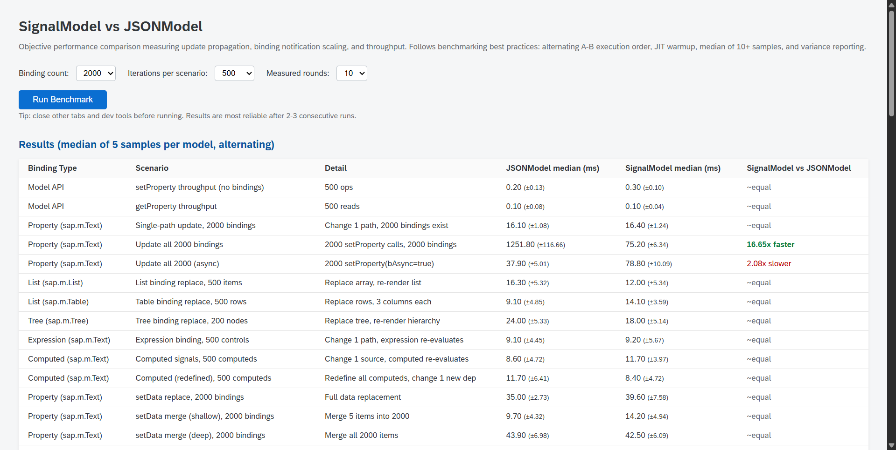

# SignalModel vs JSONModel - Performance Benchmark

Self-contained benchmark comparing SignalModel and JSONModel across all binding types.

## Quick Start

```bash
npm run start:bench
```

This starts the library dev server and opens the benchmark page in your browser.

## What It Tests

The benchmark covers 16 scenarios across all binding types, model operations, and merge strategies:

| #   | Binding Type              | Scenario                                | What It Measures                                       |
| --- | ------------------------- | --------------------------------------- | ------------------------------------------------------ |
| 1   | Model API                 | setProperty throughput (no bindings)    | Raw per-call overhead of model layer                   |
| 2   | Model API                 | getProperty throughput                  | Read performance                                       |
| 3   | Property (`sap.m.Text`)   | Single-path update, N bindings          | O(1) vs O(N) notification — the key benchmark          |
| 4   | Property (`sap.m.Text`)   | Update all N bindings (sync)            | O(N) vs O(N^2) cumulative cost                         |
| 5   | Property (`sap.m.Text`)   | Update all N bindings (async)           | JSONModel `bAsyncUpdate=true` vs signals               |
| 6   | List (`sap.m.List`)       | List binding replace                    | Array replacement with `StandardListItem` template     |
| 7   | List (`sap.m.Table`)      | Table binding replace                   | Row replacement with 3 `ColumnListItem` cells          |
| 8   | Tree (`sap.m.Tree`)       | Tree binding replace                    | Hierarchical data replacement with `StandardTreeItem`  |
| 9   | Expression (`sap.m.Text`) | Expression binding                      | Composite `{= ${/path1} + ${/path2}}` re-evaluation    |
| 10  | Computed (`sap.m.Text`)   | Computed signals                        | `createComputed` dependency chain propagation          |
| 11  | Computed (`sap.m.Text`)   | Computed (redefined)                    | `removeComputed` + `createComputed` re-subscribe cost  |
| 12  | Property (`sap.m.Text`)   | setData replace                         | Full data replacement propagation                      |
| 13  | Property (`sap.m.Text`)   | setData merge (shallow)                 | Merge 5 items into N — small payload into large data   |
| 14  | Property (`sap.m.Text`)   | setData merge (deep)                    | Merge all N items — full payload, worst case for merge |
| 15  | Property (`sap.m.Text`)   | setData merge (nested config)           | Merge 3 deep leaf paths into a 5-level config tree     |
| 16  | Property (`sap.m.Text`)   | setData merge (large dataset, pinpoint) | Merge 3 items into 10x N — tests O(k) vs O(n) merge    |

### Merge Scenario Design

The merge scenarios (13–16) are designed to test different payload shapes that exercise the `setData(data, true)` code path with varying data-to-payload ratios:

- **Shallow (13)**: Small flat payload into a large flat array. Both models pay the `deepExtend`/in-place merge cost, but the binding notification cost dominates because all N bindings exist. Tests the common "update a few fields in a form" pattern.
- **Deep (14)**: Payload covers every item. This is the worst case for merge — no savings from targeted invalidation. Both models must process all N items.
- **Nested config (15)**: A realistic deeply nested configuration object (5 levels: `app.features.notifications.push`). The merge payload touches only 3 leaf paths. Tests recursive merge depth traversal.
- **Large dataset, pinpoint (16)**: The key merge benchmark. Creates 10x N items (e.g., 10,000 for N=1000) with complex objects (7 properties, nested `metadata`), then merges only 3 items. JSONModel's `deepExtend` must deep-clone all 10,000 objects. SignalModel's in-place merge walks only the 3 payload items. This isolates the O(n) vs O(k) architectural difference.

## How It Works

### Bootstrap

The page loads UI5 via the standard bootstrap script served by `ui5 serve`. The `ui5-tooling-transpile-middleware` transpiles TypeScript on-the-fly and `ui5-tooling-modules-middleware` resolves npm dependencies (`signal-polyfill`) into UI5-compatible modules.

### Module Loading

When "Run Benchmark" is clicked, `sap.ui.require` loads:

- `sap/ui/model/json/JSONModel` (from the OpenUI5 framework)
- `ui5/model/signal/SignalModel` (from our library, transpiled from TypeScript)
- Control classes: `sap/m/Text`, `sap/m/List`, `sap/m/Table`, `sap/m/Tree`, and their list items

### Execution

Each scenario:

1. Creates a fresh model with deep-copied data (`JSON.parse(JSON.stringify(...))`)
2. Creates real UI5 controls with declarative bindings, placed in a hidden `display:none` container
3. Runs 3 warmup rounds to stabilize JIT compilation
4. Takes 1 timed measurement including full async propagation
5. Destroys all controls and the model

The `runAlternating` function interleaves JSON and Signal runs (JSON-Signal, Signal-JSON, JSON-Signal...) across all samples to cancel out GC pauses, thermal throttling, and JIT compilation bias.

### Flush Protocol

After each timed operation, a three-stage async drain ensures all notifications complete:

1. `Promise.resolve().then(...)` - drains microtask queue (SignalModel's `queueMicrotask` callbacks)
2. `setTimeout(resolve, 0)` - yields to macrotask queue (JSONModel's async `checkUpdate`)
3. `queueMicrotask(resolve)` - final microtask drain for any cascaded notifications

### Statistics

Uses Bessel-corrected (sample) variance. Reports: median, mean, standard deviation, min, max, P5, P95. Median is the primary metric as it is robust to GC-caused outliers.

## Results (2000 bindings, 500 iterations, 10 rounds)



### Full results at 2000 bindings

| Binding Type            | Scenario                            | JSONModel | SignalModel | Comparison        |
| ----------------------- | ----------------------------------- | --------- | ----------- | ----------------- |
| Model API               | setProperty (no bindings)           | 0.20ms    | 0.30ms      | ~equal            |
| Model API               | getProperty                         | 0.10ms    | 0.10ms      | ~equal            |
| Property (sap.m.Text)   | Single-path update, 2000 bindings   | 16.10ms   | 16.40ms     | ~equal            |
| Property (sap.m.Text)   | Update all 2000 (sync)              | 1251.80ms | 75.20ms     | **16.65x faster** |
| Property (sap.m.Text)   | Update all 2000 (async)             | 37.90ms   | 78.80ms     | **2.08x slower**  |
| List (sap.m.List)       | List binding replace, 500 items     | 16.30ms   | 12.00ms     | ~equal            |
| List (sap.m.Table)      | Table binding replace, 500 rows     | 9.10ms    | 14.10ms     | ~equal            |
| Tree (sap.m.Tree)       | Tree binding replace, 200 nodes     | 24.00ms   | 18.00ms     | ~equal            |
| Expression (sap.m.Text) | Expression binding, 500 controls    | 9.10ms    | 9.20ms      | ~equal            |
| Computed (sap.m.Text)   | Computed signals, 500 computeds     | 8.60ms    | 11.70ms     | ~equal            |
| Computed (sap.m.Text)   | Computed (redefined), 500 computeds | 11.70ms   | 8.40ms      | ~equal            |
| Property (sap.m.Text)   | setData replace, 2000 bindings      | 35.00ms   | 39.60ms     | ~equal            |
| Property (sap.m.Text)   | setData merge (shallow), 5 into 2k  | 9.70ms    | 14.20ms     | ~equal            |
| Property (sap.m.Text)   | setData merge (deep), all 2k        | 43.90ms   | 42.50ms     | ~equal            |
| Property (sap.m.Text)   | setData merge (nested config)       | 6.10ms    | 4.70ms      | **1.30x faster**  |
| Property (sap.m.Text)   | setData merge (large, pinpoint) 20k | 22.30ms   | 4.90ms      | **4.55x faster**  |

### Honest Observations

**Where SignalModel is faster:**

The "Update all N bindings (sync)" scenario shows the largest difference: at 2000 bindings, JSONModel takes ~1252ms while SignalModel takes ~75ms (**~17x faster**). This scales super-linearly because JSONModel's default synchronous `setProperty` calls `checkUpdate` after every single call, iterating all bindings each time — O(N²) total (2000 calls × 2000 bindings = 4,000,000 binding checks). SignalModel is O(N) total (2000 notifications, one per changed path).

**The `bAsyncUpdate` caveat:**

JSONModel's `setProperty` accepts a `bAsyncUpdate` parameter. When `true`, it batches all `checkUpdate` calls into a single `setTimeout` pass, collapsing O(N²) to O(N). The benchmark includes this scenario ("Update all N async") for an honest comparison.

With `bAsyncUpdate=true`, **JSONModel is actually faster than SignalModel** for bulk batch updates. At 2000 bindings: JSONModel-async takes ~38ms while SignalModel takes ~79ms (**~2x slower**). Both execute ONE batched pass, but the per-binding work differs:

| Step                         | JSONModel async                 | SignalModel                                                              |
| ---------------------------- | ------------------------------- | ------------------------------------------------------------------------ |
| During N `setProperty` calls | Sets data, schedules 1 timer    | Sets data, fires N watcher callbacks, each does `Map.set()`              |
| Batched flush                | 1 loop: `deepEqual` per binding | 1 loop: `signal.get()` + `watcher.watch()` + `checkUpdate()` per binding |

The overhead comes from the TC39 `Signal.subtle.Watcher` API contract: after a signal notifies its watcher, the watcher must be explicitly re-armed by calling `signal.get()` (to acknowledge the change) then `watcher.watch()` (to re-register). This is inherent to the Watcher API design itself (not a polyfill limitation) and cannot be optimized away at the application level. JSONModel's `deepEqual` comparison is a single function call per binding with no re-registration overhead. The gap grows with binding count (~1.5x at 1000, ~2x at 2000) because the re-arm cost is per-binding.

**Where SignalModel's in-place merge wins:**

The "large dataset, pinpoint merge" scenario (3 items into 20,000) shows **4.55x faster** performance. JSONModel's `deepExtend` deep-clones the entire 20,000-item array (each item has 7 properties including a nested `metadata` object) just to overlay 3 items. SignalModel's `_mergeInPlace` walks only the 3 payload keys and modifies them in-place — O(k) instead of O(n). The advantage grows linearly with the data-to-payload ratio. Real Fiori apps with large OData entity sets and form-level edits (e.g., editing 3 fields in a 5,000-row table) would see similar improvements.

The nested config merge shows a measurable **1.30x edge** where the O(n) clone cost of `deepExtend` becomes visible against targeted in-place updates.

**Computed redefinition has zero overhead:**

The "Computed (redefined)" scenario — which redefines all 500 computeds via `removeComputed` + `createComputed` with different dependencies, then measures update propagation — performs equivalently to regular computed signals. The re-subscribe bridge adds no measurable cost at runtime.

**Where both models are equivalent:**

For list, table, and tree binding scenarios where the entire aggregation is replaced, both models perform equivalently. The DOM rendering cost (destroying and recreating list items, table rows, tree nodes) dominates the model notification cost by an order of magnitude. The model layer is not the bottleneck in these scenarios.

Expression binding, computed signals, getProperty, setProperty (no bindings), setData replace, and equal-sized merges (deep at 2000 items) are all equivalent between the two models.

**What SignalModel still offers over JSONModel with `bAsyncUpdate`:**

1. **Correct by default.** Developers do not need to remember to pass `bAsyncUpdate=true`. SAP added a runtime performance warning (`checkPerformanceOfUpdate`) specifically because developers keep using the synchronous default. SignalModel is always O(1) per notification regardless of how `setProperty` is called.

2. **Per-path notification.** Even with `bAsyncUpdate=true`, JSONModel's single `checkUpdate` pass still iterates ALL bindings and runs `deepEqual` on each. With 3,000+ bindings (the scale reported in [openui5 issue 2600](https://github.com/UI5/openui5/issues/2600)), this single pass alone takes ~200ms. SignalModel notifies only the bindings on changed paths.

3. **Computed signals.** Model-layer derived values (`createComputed`) that update reactively. JSONModel has no equivalent (formatters are view-layer and do not participate in the model's dependency graph).

4. **In-place merge.** `setData(partial, true)` uses an O(k) in-place recursive merge instead of O(n) `deepExtend` clone. For large datasets with small merge payloads, this is measurably faster (4.6x at 20k items, scaling linearly with data size).

5. **TC39 Signals alignment.** When the [TC39 Signals proposal](https://github.com/tc39/proposal-signals) ships natively in browsers, `signal-polyfill` can be swapped for the native implementation with zero API changes.

## Background

- [openui5 issue 2600](https://github.com/UI5/openui5/issues/2600) - documents the `checkUpdate` O(N) bottleneck
- [openui5 issue 4351](https://github.com/UI5/openui5/issues/4351) - related DOM accumulation problem in large apps
- SAP commit `cb6c7f7a` - added `checkPerformanceOfUpdate` warning at 100,000 cumulative binding checks
